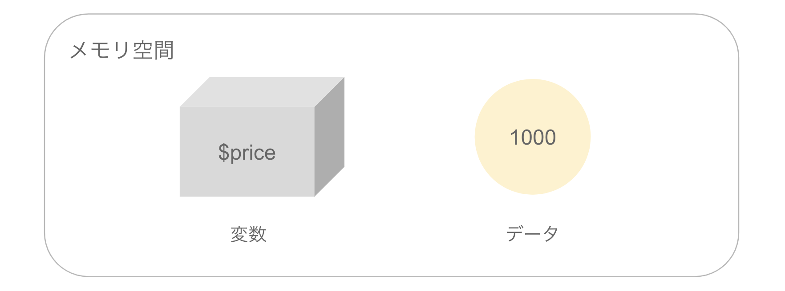
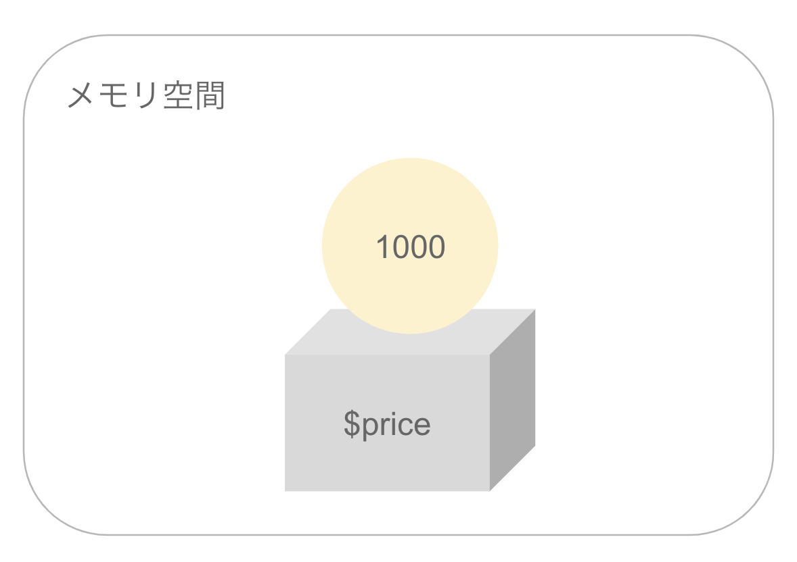

# 変数

変数とはプログラムの中で扱うデータを管理する仕組みです。具体的には変数はプログラムの実行時にメモリ上に確保される領域です。変数は箱のようなもので、変数の中にデータを代入したり、取得したりすることができます。




変数を扱う簡単なPHPプログラムを作成してみましょう。次のプログラムをvar1.phpという名前で保存します。

```php
<?php
$price = 1000;
echo $price; # => 1000
```

プログラムを作成したら実行してみましょう。ターミナルで次のように入力します。

```sh
$ php var1.php
1000
```

実行結果から1000と出力されているのがわかります。




## 変数の命名規則

さきほどのプログラムを再度確認してみましょう。

```php
<?php
$price = 1000;
echo $price;
```

上記のプログラムの中で`$price`の部分が変数になります。PHPの変数は先頭文字を$記号で始める必要があります。また$記号で始まる変数名には半角英数字やアンダースコアを使って変数名を記述します。ただし$記号の直後に数字を使うことはできません。

次のプログラム（var2.php）では`$price`、`$count`、`$total_price`という3つの変数を利用しています。いずれも妥当な変数名です。

```php
<?php
$price = 1000;
$count = 10;
$total_price = $price * $count;
echo $total_price; # => 10000
```

一方で次のようなプログラム（var3.php）は変数名のルールを満たしていないのでエラーとなります。

```php
<?php
price = 1000; # $記号で始まっていないのでエラー
$1count = 10; # $記号の直後に数字は使えないのでエラー
$total-price = 1000 * 10; # 変数名に-（ハイフン）は使えないのでエラー
```

### 大文字小文字について

変数名は大文字小文字は区別します。次のプログラム（var4.php）を見てみましょう。

```php
<?php
$price = 100;
$Price = 200;
$PRICE = 300;
echo $price . PHP_EOL; # => 100
echo $Price . PHP_EOL; # => 200
echo $PRICE . PHP_EOL; # => 300
```

ここでは`$price`、`$Price`、`$PRICE`という3つの変数を定義していますが、それぞれ異なる変数として利用することができます。

> PHPでは変数名の大文字小文字について厳密なルールはありません。開発するアプリケーションの中で統一した書き方を意識していくと良いでしょう。

## 変数の代入

変数にデータを代入するには`=`記号を使います。`=`記号は代入演算子とも呼ばれます。ここではvar1.phpを再掲します。

```php
<?php
$price = 1000;
echo $price;
```

ここでは`=`記号（代入演算子）を使って、変数`$price`に`1000`というデータを代入しています。

変数の代入は次のような構文になります。

```php
$変数名 = データ;
```

上記のように、代入先となる変数をまず先に記述し、次に代入演算子、それから変数に代入したいデータを並べます。たとえば次のような記述は誤りです。

```php
<?php
1000 = $price; # 代入先の変数を先に記述していないのでエラー
echo $price;
```

> プログラミングに慣れないうちは、必ず代入先となる変数名を先頭に記述する、という点を意識していきましょう。

### 変数の再代入

変数は代入したデータを新たな代入により上書きすることもできます。次のプログラム（var5.php）を作成してみましょう。


```php
<?php
$price = 1000;
echo $price . PHP_EOL; # => 1000
$price = 2000;
echo $price . PHP_EOL; # => 2000
```

プログラムを実行するとechoによる初回の出力では1000が出力され、2回目の出力では2000が出力されるのがわかるでしょう。このように変数に代入されたデータは、次の代入時に上書きされることになります。


## 変数の参照

変数に代入されたデータは後続の処理で再利用することができます。ここではvar1.phpを再掲します。

```php
<?php
$price = 1000;
echo $price;
```

上記のプログラムでは変数`$price`を後のecho命令により出力しています。また前述したvar2.phpのように足し算や掛け算のような演算に利用することもできます。

```php
<?php
$price = 1000;
$count = 10;
$total_price = $price * $count;
echo $total_price; # => 10000
```
